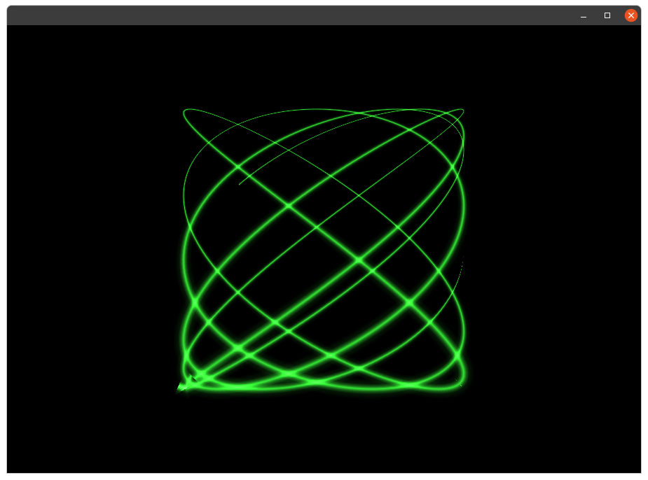

# pofBeam

pofBeam is a Pof (see [https://github.com/Ant1r/ofxPof](https://github.com/Ant1r/ofxPof)) addon for drawing textured thick paths, for example to draw an oscilloscope-like beam.

The algorithm is simple enough to allow adding points at audio rate, which partly explains why it produces some wrong artifacts...
Which doesn't mean that it could not be improved!

The main repository of this project is [https://github.com/MetaluNet/pofBeam](https://github.com/MetaluNet/pofBeam)

(c) metalu.net/NinjaTune 2023  
BSD Simplified License.  
For information on usage and redistribution, and for a DISCLAIMER OF ALL WARRANTIES, see the file "LICENSE.txt" in this distribution.
